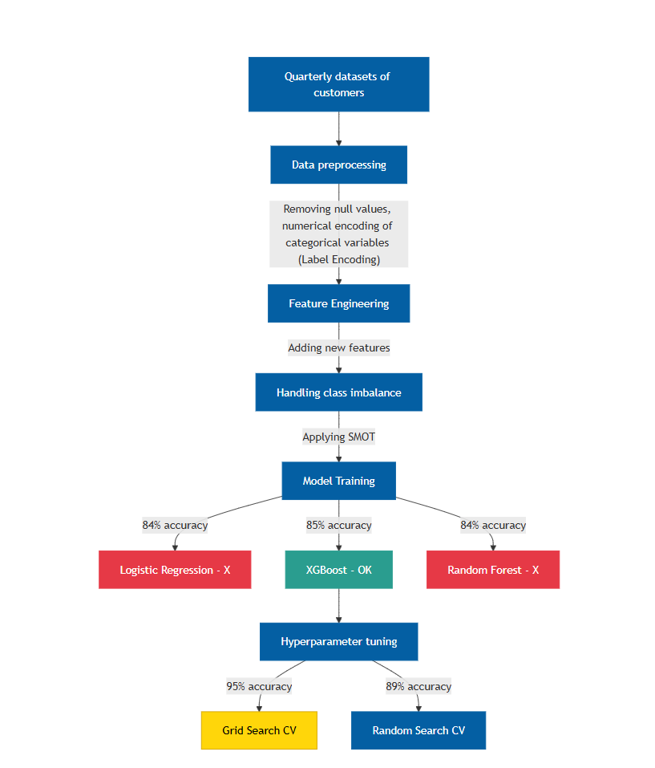
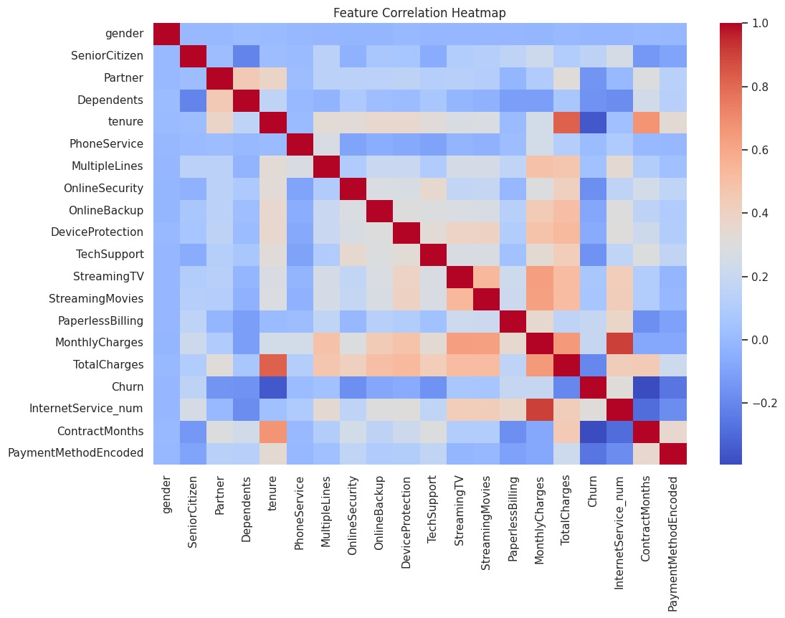
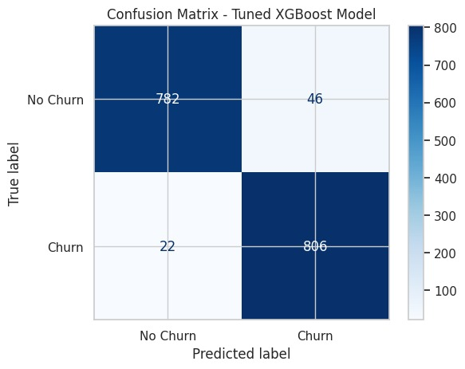

# Our Repository consisting of our XGBoost Machine Learning model with 95% accuracy for Customer Churn Prediction

**The Gradient Descendants**

Descrption of project:

Team members:
1. Yashwanth B L
2. Mehaboob S

## Problem Statement:
**Predict whether a customer will churn (leave the service) based on
demographic details, service subscriptions, billing information, and
engagement patterns.**

## Data set:

Telecom datasets usually contain information such as:

Customer demographics: age, gender, location, tenure with the company.

Service details: type of plan (prepaid/postpaid), internet usage, call minutes, SMS counts.

Billing information: monthly charges, total charges, payment methods.

Network usage: data consumption, dropped calls, roaming activity.

Churn labels: whether a customer stayed or left (common in telecom churn datasets).

## Solution:

We’re building an intelligent Decision Support System for telecom organizations that predicts which customers are most likely to migrate to other service helping teams with smart, data-driven recommendations to enhance service delivery and optimize infrastructure investments.

Build a classification model which predicts whether a customer will be retained or migrate to a different service based on his/her usage pattern of demographics, account details, and infrastructure availability.

Build a web based interface where an Telecom Organization enter the customer demographic details and reason if the customer will use the same service or not. 

## Some Insights from the Colab Notebook that we found useful!

